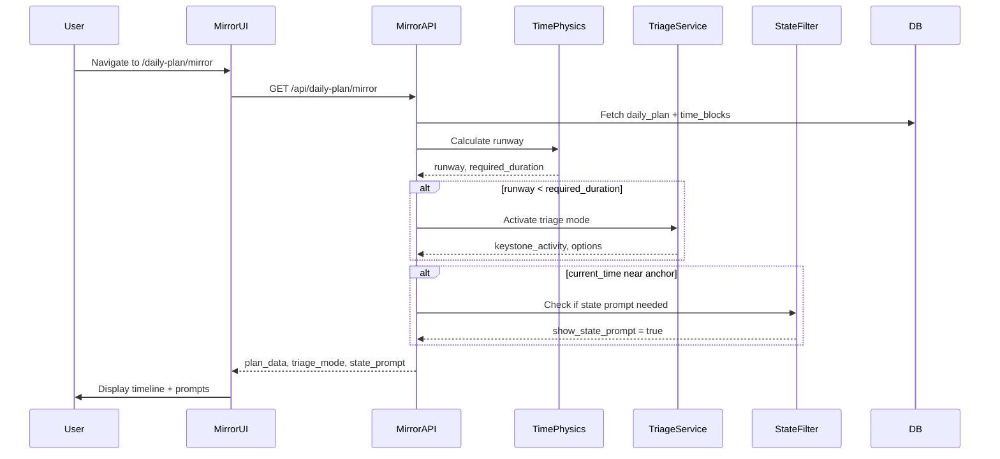
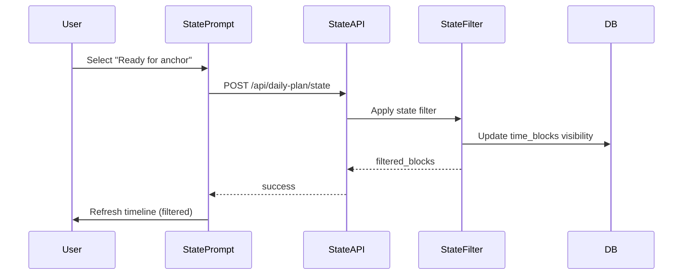
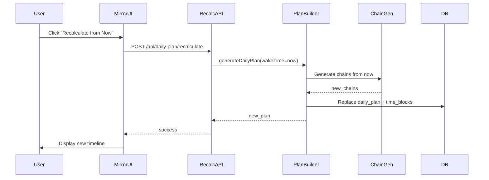

# Design Document: Triage Mirror Stateless

## Overview

The Triage Mirror Stateless feature extends MeshOS's V2 chain-based planning system with real-time adaptation capabilities for users with executive dysfunction. When plans break mid-day (late wake, missed anchor, overwhelm), users need immediate triage support, state declaration, and flexible plan adjustment without complex navigation.

This design builds on the existing ChainGenerator, WakeRampGenerator, and commitment envelope architecture. The Mirror UI provides a simplified, mobile-first vertical timeline at `/daily-plan/mirror` with inline editing, completion tracking, and stateless recalculation capabilities.

### Core Principles

1. **Calm, not judgmental** - No guilt for missed steps or broken plans
2. **Fast, not overwhelming** - One tap to declare state, one tap to complete
3. **Flexible, not rigid** - Edit anything inline, no navigation required
4. **Clear, not cluttered** - Prominent deadlines, hidden irrelevant info
5. **Resilient, not fragile** - Works with zero data, graceful fallbacks

### Key Capabilities

- **Runway Calculation**: Real-time calculation of time remaining until next anchor
- **Triage Mode**: Automatic activation when runway < required duration
- **State Declaration**: 6-option prompt to filter timeline based on user's current position
- **Mirror UI**: Simplified vertical timeline with inline editing and completion tracking
- **Stateless Recalc**: Optional auto-regeneration or manual "Recalculate from Now" button
- **Completion Tracking**: Persistent tap-to-complete with visual progress indicators
- **Inline Editing**: Direct editing of anchors, step durations, and custom step insertion
- **Deadline Visibility**: Prominent "Complete by" banners with time remaining
- **Intent Signal**: Neutral re-engagement prompt after 7+ day absence

## Architecture

### System Components

```mermaid
graph TB
    subgraph "Client Layer"
        MirrorUI[Mirror UI Component]
        StatePrompt[State Declaration Prompt]
        TriagePrompt[Triage Prompt]
        TimelineView[Timeline View]
        InlineEditor[Inline Editor]
        CompletionControls[Completion Controls]
    end

    subgraph "API Layer"
        MirrorAPI[/api/daily-plan/mirror]
        RecalcAPI[/api/daily-plan/recalculate]
        StateAPI[/api/daily-plan/state]
        CompletionAPI[/api/time-blocks/:id/complete]
        EditAPI[/api/time-blocks/:id/edit]
    end

    subgraph "Service Layer"
        TimePhysics[Time Physics Service]
        TriageService[Triage Service]
        StateFilter[State Filter Service]
        PlanBuilder[Plan Builder Service]
    end

    subgraph "Existing V2 Components"
        ChainGen[Chain Generator]
        WakeRamp[Wake Ramp Generator]
        LocationTracker[Location State Tracker]
        AnchorService[Anchor Service]
    end

    subgraph "Database"
        DailyPlans[(daily_plans)]
        TimeBlocks[(time_blocks)]
        UserPrefs[(user_preferences)]
    end

    MirrorUI --> MirrorAPI
    MirrorUI --> StatePrompt
    MirrorUI --> TriagePrompt
    MirrorUI --> TimelineView
    TimelineView --> InlineEditor
    TimelineView --> CompletionControls

    MirrorAPI --> TimePhysics
    MirrorAPI --> TriageService
    MirrorAPI --> StateFilter

    RecalcAPI --> PlanBuilder
    StateAPI --> StateFilter
    CompletionAPI --> TimeBlocks
    EditAPI --> TimeBlocks
    EditAPI --> PlanBuilder

    TimePhysics --> TimeBlocks
    TriageService --> TimePhysics
    StateFilter --> TimeBlocks

    PlanBuilder --> ChainGen
    PlanBuilder --> WakeRamp
    PlanBuilder --> LocationTracker
    PlanBuilder --> AnchorService

    PlanBuilder --> DailyPlans
    PlanBuilder --> TimeBlocks
    StateFilter --> UserPrefs
```

### Data Flow

#### 1. Mirror UI Load Flow



#### 2. State Declaration Flow



#### 3. Recalculation Flow



## Components and Interfaces

### 1. Time Physics Service

Calculates runway and required duration for triage decisions.

```typescript
// src/lib/triage/time-physics.ts

export interface RunwayCalculation {
  runway: number | null; // minutes until next anchor, null if no anchors
  required_duration: number | null; // total minutes needed for commitment envelope
  next_anchor_id: string | null;
  next_anchor_start: Date | null;
  current_time: Date;
  has_sufficient_time: boolean;
}

export class TimePhysicsService {
  /**
   * Calculate runway for next anchor
   * Requirements: 1.1, 1.2, 1.3, 1.4, 1.5
   */
  calculateRunway(
    timeBlocks: TimeBlock[],
    currentTime: Date = new Date(),
  ): RunwayCalculation {
    // Find next anchor after current time
    const futureAnchors = timeBlocks
      .filter(
        (block) =>
          block.metadata?.role?.type === "anchor" &&
          block.startTime > currentTime,
      )
      .sort((a, b) => a.startTime.getTime() - b.startTime.getTime());

    if (futureAnchors.length === 0) {
      return {
        runway: null,
        required_duration: null,
        next_anchor_id: null,
        next_anchor_start: null,
        current_time: currentTime,
        has_sufficient_time: true,
      };
    }

    const nextAnchor = futureAnchors[0];
    const runwayMinutes = Math.floor(
      (nextAnchor.startTime.getTime() - currentTime.getTime()) / 60000,
    );

    // Calculate required duration from commitment envelope
    const envelopeBlocks = timeBlocks.filter(
      (block) =>
        block.metadata?.anchor_id === nextAnchor.activityId &&
        block.startTime < nextAnchor.startTime,
    );

    const requiredDuration = envelopeBlocks.reduce((total, block) => {
      const duration = Math.floor(
        (block.endTime.getTime() - block.startTime.getTime()) / 60000,
      );
      return total + duration;
    }, 0);

    return {
      runway: runwayMinutes,
      required_duration: requiredDuration,
      next_anchor_id: nextAnchor.activityId || null,
      next_anchor_start: nextAnchor.startTime,
      current_time: currentTime,
      has_sufficient_time: runwayMinutes >= requiredDuration,
    };
  }
}
```

### 2. Triage Service

Manages triage mode activation and keystone identification.

```typescript
// src/lib/triage/triage-service.ts

export interface TriageDecision {
  mode: "protect_keystone" | "skip_anchor" | "recalculate";
  anchor_id: string;
}

export interface TriageState {
  active: boolean;
  keystone_activity: TimeBlock | null;
  anchor: TimeBlock | null;
  options: TriageOption[];
}

export interface TriageOption {
  id: "protect_keystone" | "skip_anchor" | "recalculate";
  label: string;
  description: string;
}

export class TriageService {
  /**
   * Determine if triage mode should activate
   * Requirements: 2.1, 2.2, 2.3, 2.4, 2.5
   */
  shouldActivateTriage(runway: RunwayCalculation): boolean {
    if (runway.runway === null || runway.required_duration === null) {
      return false;
    }
    return runway.runway < runway.required_duration;
  }

  /**
   * Identify keystone activity for triage
   * Requirements: 10.1, 10.2, 10.3, 10.4, 10.5
   */
  identifyKeystoneActivity(
    timeBlocks: TimeBlock[],
    anchorId: string,
  ): TimeBlock | null {
    const anchor = timeBlocks.find(
      (block) =>
        block.activityId === anchorId &&
        block.metadata?.role?.type === "anchor",
    );

    if (!anchor) return null;

    // Priority order: anchor > prep (if >15min) > recovery
    const anchorType = anchor.metadata?.original_anchor_type || "other";

    if (anchorType === "class" || anchorType === "seminar") {
      return anchor; // Keystone is the anchor itself
    }

    if (anchorType === "appointment") {
      // Check prep duration
      const prepBlock = timeBlocks.find(
        (block) =>
          block.metadata?.anchor_id === anchorId &&
          block.metadata?.commitment_envelope?.envelope_type === "prep",
      );

      if (prepBlock) {
        const prepDuration = Math.floor(
          (prepBlock.endTime.getTime() - prepBlock.startTime.getTime()) / 60000,
        );
        if (prepDuration > 15) {
          return prepBlock;
        }
      }
    }

    return anchor; // Default to anchor
  }

  /**
   * Get triage state for UI
   * Requirements: 2.1, 2.2, 2.3, 2.4, 2.5, 10.1, 10.2, 10.3, 10.4, 10.5
   */
  getTriageState(
    timeBlocks: TimeBlock[],
    runway: RunwayCalculation,
  ): TriageState {
    if (!this.shouldActivateTriage(runway)) {
      return {
        active: false,
        keystone_activity: null,
        anchor: null,
        options: [],
      };
    }

    const anchor = timeBlocks.find(
      (block) =>
        block.activityId === runway.next_anchor_id &&
        block.metadata?.role?.type === "anchor",
    );

    const keystoneActivity = runway.next_anchor_id
      ? this.identifyKeystoneActivity(timeBlocks, runway.next_anchor_id)
      : null;

    return {
      active: true,
      keystone_activity: keystoneActivity,
      anchor: anchor || null,
      options: [
        {
          id: "protect_keystone",
          label: "Protect Keystone",
          description: `Keep only ${keystoneActivity?.activityName || "essential activity"} and anchor`,
        },
        {
          id: "skip_anchor",
          label: "Skip Anchor",
          description: "Mark anchor as skipped and remove from timeline",
        },
        {
          id: "recalculate",
          label: "Recalculate",
          description: "Generate fresh plan from current time",
        },
      ],
    };
  }
}
```

### 3. State Filter Service

Filters timeline based on user's declared state.

```typescript
// src/lib/triage/state-filter.ts

export type UserState =
  | "starting_day"
  | "ready_for_anchor"
  | "mid_chain"
  | "at_anchor"
  | "missed_it"
  | "just_checking";

export interface StateDeclaration {
  state: UserState;
  selected_step_id?: string; // For mid_chain state
  timestamp: Date;
}

export interface FilteredTimeline {
  visible_blocks: TimeBlock[];
  hidden_blocks: TimeBlock[];
  filter_reason: string;
}

export class StateFilterService {
  /**
   * Filter timeline based on declared state
   * Requirements: 16.1, 16.2, 16.3, 16.4, 16.5, 16.6, 16.7, 16.8, 16.9, 16.10
   */
  filterTimeline(
    timeBlocks: TimeBlock[],
    state: StateDeclaration,
    currentTime: Date = new Date(),
  ): FilteredTimeline {
    switch (state.state) {
      case "starting_day":
        return this.filterStartingDay(timeBlocks, currentTime);

      case "ready_for_anchor":
        return this.filterReadyForAnchor(timeBlocks, currentTime);

      case "mid_chain":
        return this.filterMidChain(
          timeBlocks,
          state.selected_step_id,
          currentTime,
        );

      case "at_anchor":
        return this.filterAtAnchor(timeBlocks, currentTime);

      case "missed_it":
        return this.filterMissedIt(timeBlocks, currentTime);

      case "just_checking":
        return {
          visible_blocks: timeBlocks,
          hidden_blocks: [],
          filter_reason: "No filter applied",
        };

      default:
        return {
          visible_blocks: timeBlocks,
          hidden_blocks: [],
          filter_reason: "Unknown state",
        };
    }
  }

  private filterStartingDay(
    timeBlocks: TimeBlock[],
    currentTime: Date,
  ): FilteredTimeline {
    // Show full activation chain from current time
    const visible = timeBlocks.filter(
      (block) => block.startTime >= currentTime,
    );
    const hidden = timeBlocks.filter((block) => block.startTime < currentTime);

    // Mark all visible blocks as pending
    visible.forEach((block) => {
      if (block.status !== "completed") {
        block.status = "pending";
      }
    });

    return {
      visible_blocks: visible,
      hidden_blocks: hidden,
      filter_reason: "Starting day - showing full chain from now",
    };
  }

  private filterReadyForAnchor(
    timeBlocks: TimeBlock[],
    currentTime: Date,
  ): FilteredTimeline {
    // Hide all activation chain steps, show only departure + anchor + recovery
    const nextAnchor = timeBlocks.find(
      (block) =>
        block.metadata?.role?.type === "anchor" &&
        block.startTime > currentTime,
    );

    if (!nextAnchor) {
      return {
        visible_blocks: timeBlocks,
        hidden_blocks: [],
        filter_reason: "No upcoming anchor found",
      };
    }

    const anchorId = nextAnchor.activityId;

    const visible = timeBlocks.filter((block) => {
      // Show travel_there, anchor, travel_back, recovery
      if (block.metadata?.anchor_id === anchorId) {
        const envelopeType = block.metadata?.commitment_envelope?.envelope_type;
        return (
          envelopeType === "travel_there" ||
          envelopeType === "anchor" ||
          envelopeType === "travel_back" ||
          envelopeType === "recovery"
        );
      }
      // Show blocks after anchor
      return block.startTime > nextAnchor.endTime;
    });

    const hidden = timeBlocks.filter((block) => !visible.includes(block));

    return {
      visible_blocks: visible,
      hidden_blocks: hidden,
      filter_reason: "Ready for anchor - hiding activation chain",
    };
  }

  private filterMidChain(
    timeBlocks: TimeBlock[],
    selectedStepId: string | undefined,
    currentTime: Date,
  ): FilteredTimeline {
    if (!selectedStepId) {
      // No step selected, show from current time
      return this.filterStartingDay(timeBlocks, currentTime);
    }

    const selectedIndex = timeBlocks.findIndex(
      (block) => block.metadata?.step_id === selectedStepId,
    );

    if (selectedIndex === -1) {
      return {
        visible_blocks: timeBlocks,
        hidden_blocks: [],
        filter_reason: "Selected step not found",
      };
    }

    // Mark prior steps as completed
    const visible = timeBlocks.slice(selectedIndex);
    const hidden = timeBlocks.slice(0, selectedIndex);

    hidden.forEach((block) => {
      block.status = "completed";
    });

    return {
      visible_blocks: visible,
      hidden_blocks: hidden,
      filter_reason: "Mid-chain - showing from selected step",
    };
  }

  private filterAtAnchor(
    timeBlocks: TimeBlock[],
    currentTime: Date,
  ): FilteredTimeline {
    // Find current anchor
    const currentAnchor = timeBlocks.find(
      (block) =>
        block.metadata?.role?.type === "anchor" &&
        block.startTime <= currentTime &&
        block.endTime >= currentTime,
    );

    if (!currentAnchor) {
      return {
        visible_blocks: timeBlocks,
        hidden_blocks: [],
        filter_reason: "No current anchor found",
      };
    }

    const anchorId = currentAnchor.activityId;

    // Mark prep and travel_there as completed
    const visible: TimeBlock[] = [];
    const hidden: TimeBlock[] = [];

    timeBlocks.forEach((block) => {
      if (block.metadata?.anchor_id === anchorId) {
        const envelopeType = block.metadata?.commitment_envelope?.envelope_type;
        if (envelopeType === "prep" || envelopeType === "travel_there") {
          block.status = "completed";
          hidden.push(block);
        } else {
          visible.push(block);
        }
      } else if (block.startTime >= currentAnchor.startTime) {
        visible.push(block);
      } else {
        hidden.push(block);
      }
    });

    return {
      visible_blocks: visible,
      hidden_blocks: hidden,
      filter_reason: "At anchor - prep and travel marked complete",
    };
  }

  private filterMissedIt(
    timeBlocks: TimeBlock[],
    currentTime: Date,
  ): FilteredTimeline {
    // Find most recent anchor that was missed
    const missedAnchor = timeBlocks
      .filter(
        (block) =>
          block.metadata?.role?.type === "anchor" &&
          block.endTime < currentTime,
      )
      .sort((a, b) => b.endTime.getTime() - a.endTime.getTime())[0];

    if (!missedAnchor) {
      return {
        visible_blocks: timeBlocks,
        hidden_blocks: [],
        filter_reason: "No missed anchor found",
      };
    }

    const anchorId = missedAnchor.activityId;

    // Mark anchor and all related steps as skipped
    const visible = timeBlocks.filter((block) => {
      if (block.metadata?.anchor_id === anchorId) {
        block.status = "skipped";
        block.skipReason = "User declared missed";
        return false;
      }
      return block.startTime > missedAnchor.endTime;
    });

    const hidden = timeBlocks.filter((block) => !visible.includes(block));

    return {
      visible_blocks: visible,
      hidden_blocks: hidden,
      filter_reason: "Missed anchor - marked as skipped",
    };
  }

  /**
   * Check if state prompt should be shown
   * Requirements: 16.1, 16.9, 23.5
   */
  shouldShowStatePrompt(
    lastDeclaration: StateDeclaration | null,
    timeBlocks: TimeBlock[],
    currentTime: Date = new Date(),
  ): boolean {
    // Don't show if declared within last 30 minutes
    if (lastDeclaration) {
      const minutesSinceDeclaration = Math.floor(
        (currentTime.getTime() - lastDeclaration.timestamp.getTime()) / 60000,
      );
      if (minutesSinceDeclaration < 30) {
        return false;
      }
    }

    // Show if current time is within 2 hours of any anchor
    const nearbyAnchors = timeBlocks.filter((block) => {
      if (block.metadata?.role?.type !== "anchor") return false;
      const minutesUntilAnchor = Math.floor(
        (block.startTime.getTime() - currentTime.getTime()) / 60000,
      );
      return minutesUntilAnchor >= -30 && minutesUntilAnchor <= 120;
    });

    return nearbyAnchors.length > 0;
  }
}
```

### 4. Mirror UI Component

Main React component for the Mirror UI.

```typescript
// src/components/daily-plan/MirrorUI.tsx

export interface MirrorUIProps {
  userId: string;
}

export interface MirrorData {
  plan: DailyPlan;
  timeBlocks: TimeBlock[];
  runway: RunwayCalculation;
  triageState: TriageState;
  showStatePrompt: boolean;
  lastStateDeclaration: StateDeclaration | null;
  editMode: boolean;
}

export function MirrorUI({ userId }: MirrorUIProps) {
  const [data, setData] = useState<MirrorData | null>(null);
  const [loading, setLoading] = useState(true);
  const [error, setError] = useState<string | null>(null);
  const [editMode, setEditMode] = useState(false);

  // Load mirror data
  useEffect(() => {
    loadMirrorData();
  }, [userId]);

  async function loadMirrorData() {
    try {
      setLoading(true);
      const response = await fetch('/api/daily-plan/mirror');
      if (!response.ok) throw new Error('Failed to load mirror data');
      const mirrorData = await response.json();
      setData(mirrorData);
    } catch (err) {
      setError(err instanceof Error ? err.message : 'Unknown error');
    } finally {
      setLoading(false);
    }
  }

  async function handleRecalculate() {
    try {
      setLoading(true);
      const response = await fetch('/api/daily-plan/recalculate', {
        method: 'POST',
      });
      if (!response.ok) throw new Error('Recalculation failed');
      await loadMirrorData();
    } catch (err) {
      setError(err instanceof Error ? err.message : 'Recalculation failed');
    } finally {
      setLoading(false);
    }
  }

  async function handleStateDeclaration(state: UserState, stepId?: string) {
    try {
      const response = await fetch('/api/daily-plan/state', {
        method: 'POST',
        headers: { 'Content-Type': 'application/json' },
        body: JSON.stringify({ state, selected_step_id: stepId }),
      });
      if (!response.ok) throw new Error('State declaration failed');
      await loadMirrorData();
    } catch (err) {
      setError(err instanceof Error ? err.message : 'State declaration failed');
    }
  }

  async function handleTriageDecision(decision: TriageDecision) {
    try {
      const response = await fetch('/api/daily-plan/triage', {
        method: 'POST',
        headers: { 'Content-Type': 'application/json' },
        body: JSON.stringify(decision),
      });
      if (!response.ok) throw new Error('Triage decision failed');
      await loadMirrorData();
    } catch (err) {
      setError(err instanceof Error ? err.message : 'Triage decision failed');
    }
  }

  if (loading) return <LoadingSpinner />;
  if (error) return <ErrorMessage message={error} onRetry={loadMirrorData} />;
  if (!data) return <EmptyState />;

  return (
    <div className="mirror-ui min-h-screen bg-background">
      {/* Header */}
      <MirrorHeader
        editMode={editMode}
        onToggleEditMode={() => setEditMode(!editMode)}
        onRecalculate={handleRecalculate}
      />

      {/* Triage Prompt */}
      {data.triageState.active && (
        <TriagePrompt
          triageState={data.triageState}
          onDecision={handleTriageDecision}
        />
      )}

      {/* State Declaration Prompt */}
      {data.showStatePrompt && (
        <StateDeclarationPrompt
          onDeclare={handleStateDeclaration}
          onDismiss={() => setData({ ...data, showStatePrompt: false })}
        />
      )}

      {/* Timeline */}
      <Timeline
        timeBlocks={data.timeBlocks}
        editMode={editMode}
        onBlockComplete={(blockId) => handleBlockComplete(blockId)}
        onBlockEdit={(blockId, updates) => handleBlockEdit(blockId, updates)}
        onRefresh={loadMirrorData}
      />
    </div>
  );
}
```

## Data Models

### Database Schema Changes

No schema changes required. The feature uses existing tables with metadata extensions:

#### time_blocks table (existing)

```sql
-- No changes needed
-- Uses metadata JSONB field for:
-- - role (anchor, chain-step, exit-gate, recovery)
-- - chain_id, step_id, anchor_id
-- - commitment_envelope (envelope_id, envelope_type)
-- - location_state (at_home, not_home)
```

#### user_preferences table (existing)

```sql
-- Add new preference field in preferences JSONB:
-- {
--   "recalc_on_open": boolean,
--   "last_state_declaration": {
--     "state": string,
--     "selected_step_id": string | null,
--     "timestamp": string
--   }
-- }
```

### TypeScript Interfaces

```typescript
// Extended TimeBlock metadata (already defined in types/daily-plan.ts)
export interface TimeBlockMetadata {
  // Existing V2 fields
  role?: {
    type: "anchor" | "chain-step" | "exit-gate" | "recovery";
    required: boolean;
    chain_id?: string;
    gate_conditions?: Array<{
      id: string;
      name: string;
      satisfied: boolean;
    }>;
  };
  chain_id?: string;
  step_id?: string;
  anchor_id?: string;
  location_state?: "at_home" | "not_home";
  commitment_envelope?: {
    envelope_id: string;
    envelope_type:
      | "prep"
      | "travel_there"
      | "anchor"
      | "travel_back"
      | "recovery";
  };

  // New fields for triage-mirror-stateless
  visibility?: "visible" | "hidden";
  filter_reason?: string;
  completed_at?: string;
  completed_by?: string;
}

// User preferences extension
export interface UserPreferences {
  recalc_on_open?: boolean;
  last_state_declaration?: StateDeclaration;
}
```

## Correctness Properties

_A property is a characteristic or behavior that should hold true across all valid executions of a system—essentially, a formal statement about what the system should do. Properties serve as the bridge between human-readable specifications and machine-verifiable correctness guarantees._

### Property Reflection

After analyzing all 23 requirements with 100+ acceptance criteria, I identified the following redundancies and consolidations:

**Redundancy Analysis:**

1. **Runway Calculation Properties (1.1, 1.2)**: These can be combined into a single comprehensive property about correct runway calculation that includes both the time difference and required duration sum.

2. **Triage Activation Properties (2.1, 2.2)**: These are logical inverses and can be combined into one property: "Triage mode activates if and only if runway < required_duration"

3. **State Filter Properties (16.3-16.8)**: Each state declaration has its own filtering logic, but they all follow the same pattern: "For any state declaration, applying the filter produces the correct visible/hidden block sets." These can be consolidated into one comprehensive property with state-specific test cases.

4. **Completion Tracking Properties (17.2, 17.3, 23.1)**: These all test database persistence of status changes and can be combined into one property about status persistence.

5. **UI Element Properties**: Many requirements (4.4, 5.1, 7.1, 11.1, 11.2, 19.4, 20.1) test for presence of specific UI elements. These are better tested as examples rather than properties, as they're specific cases rather than universal rules.

6. **Recalc Properties (6.5, 7.2, 8.1)**: These all test that recalculation calls the right function with the right parameters. Can be consolidated into one property.

7. **Performance Properties (1.3, 4.5, 10.4, 12.1, 12.2, 13.5)**: While important, these are better tested separately as performance benchmarks rather than correctness properties.

**Consolidated Property Set:**

After removing redundancies, we have 28 core properties that provide comprehensive coverage without overlap.

### Property 1: Runway Calculation Correctness

_For any_ timeline with time blocks and any current time, calculating runway should return (next_anchor_start - current_time) in minutes for the runway value, and the sum of all commitment envelope step durations for required_duration.

**Validates: Requirements 1.1, 1.2**

### Property 2: Runway Null Handling

_For any_ timeline with no future anchors after current time, calculating runway should return null for both runway and required_duration.

**Validates: Requirements 1.4**

### Property 3: Runway Statelessness

_For any_ timeline, calculating runway at two different current times should produce different results reflecting the new time positions.

**Validates: Requirements 1.5**

### Property 4: Triage Activation Condition

_For any_ runway calculation result, triage mode should activate if and only if runway is not null and runway < required_duration.

**Validates: Requirements 2.1, 2.2, 2.5**

### Property 5: Keystone Identification for Class/Seminar

_For any_ commitment envelope where the anchor type is "class" or "seminar", the identified keystone activity should be the anchor block itself.

**Validates: Requirements 10.2**

### Property 6: Keystone Identification for Appointment

_For any_ commitment envelope where the anchor type is "appointment", the identified keystone activity should be the prep block if prep duration > 15 minutes, otherwise the anchor block.

**Validates: Requirements 10.3**

### Property 7: Protect Keystone Transformation

_For any_ commitment envelope, applying the "Protect Keystone" triage decision should result in a timeline containing only the keystone activity and anchor blocks, with all other envelope blocks removed.

**Validates: Requirements 3.2**

### Property 8: Skip Anchor Transformation

_For any_ commitment envelope, applying the "Skip Anchor" triage decision should result in all blocks with that anchor_id being marked as status='skipped' and removed from the visible timeline.

**Validates: Requirements 3.3**

### Property 9: Triage Session Persistence

_For any_ triage decision, no database writes should occur—the decision should only affect the current session state.

**Validates: Requirements 3.5**

### Property 10: Timeline Chronological Ordering

_For any_ set of time blocks, the Mirror UI should display them sorted by start_time in ascending order.

**Validates: Requirements 4.3**

### Property 11: Current Block Highlighting

_For any_ timeline and current time, if current time falls within a time block's [start_time, end_time] range, that block should be highlighted.

**Validates: Requirements 5.4**

### Property 12: Recalc Preference Storage Round-Trip

_For any_ boolean value, storing it as recalc_on_open preference and then retrieving it should return the same value.

**Validates: Requirements 6.1**

### Property 13: Recalc on Open Behavior

_For any_ user with recalc_on_open=true, loading the Mirror UI should trigger generateDailyPlan() with current time as wakeTime before rendering.

**Validates: Requirements 6.2, 6.5, 7.2, 8.1**

### Property 14: Recalc Preference Preservation

_For any_ recalculation triggered from Mirror UI, the user's stored wake_time and sleep_time preferences should remain unchanged after recalc completes.

**Validates: Requirements 7.4**

### Property 15: Recalc Plan Replacement

_For any_ recalculation, the system should replace (not duplicate) the existing daily_plan record for the current date.

**Validates: Requirements 8.3**

### Property 16: Recalc Graceful Fallback

_For any_ recalculation request where DailyContext data is unavailable, the system should complete successfully using default values rather than failing.

**Validates: Requirements 8.5**

### Property 17: Intent Signal Absence Detection

_For any_ user with no daily_plan records for N consecutive days where N >= 7, opening the app should display the Intent Signal banner.

**Validates: Requirements 9.1**

### Property 18: Intent Signal Dismissal Persistence

_For any_ Intent Signal dismissal, the banner should not reappear until the next app open (new session).

**Validates: Requirements 9.4**

### Property 19: State Declaration Prompt Timing

_For any_ timeline and current time, the state declaration prompt should be shown if and only if: (1) no declaration exists within the last 30 minutes, AND (2) current time is within 2 hours (before or after) of any anchor.

**Validates: Requirements 16.1, 23.5**

### Property 20: Starting Day State Filter

_For any_ timeline and current time, applying "Starting my day" state should result in visible blocks being all blocks with start_time >= current_time, all marked as status='pending'.

**Validates: Requirements 16.3**

### Property 21: Ready for Anchor State Filter

_For any_ timeline with a future anchor, applying "Ready for anchor" state should result in visible blocks being only travel_there, anchor, travel_back, and recovery blocks for that anchor, with all activation chain blocks hidden.

**Validates: Requirements 16.4**

### Property 22: Mid-Chain State Filter

_For any_ timeline and selected step, applying "Mid-chain" state should result in visible blocks being all blocks from the selected step onward, with all prior blocks marked as status='completed'.

**Validates: Requirements 16.5**

### Property 23: At Anchor State Filter

_For any_ timeline with a current anchor, applying "At anchor" state should result in all prep and travel_there blocks for that anchor being marked as status='completed' and hidden.

**Validates: Requirements 16.6**

### Property 24: Missed It State Filter

_For any_ timeline with a past anchor, applying "Missed it" state should result in all blocks with that anchor_id being marked as status='skipped' and hidden.

**Validates: Requirements 16.7**

### Property 25: Ready for Anchor Triage Trigger

_For any_ timeline where user selects "Ready for anchor" state and current time is past the departure time (first travel_there block start), triage mode should activate.

**Validates: Requirements 16.10**

### Property 26: Completion Status Persistence

_For any_ time block status change (completed or skipped), the new status should be immediately persisted to the time_blocks table and restored on next page load.

**Validates: Requirements 17.2, 17.3, 23.1, 23.2, 23.3**

### Property 27: Anchor Edit Conflict Detection

_For any_ anchor edit that would cause the new anchor time range to overlap with an existing anchor time range, the inline editor should display a validation error.

**Validates: Requirements 18.4**

### Property 28: Step Duration Cascade

_For any_ chain step duration change, all subsequent steps in the same chain should have their start_time and end_time recalculated to maintain continuity (each step starts when the previous ends).

**Validates: Requirements 19.3**

### Property 29: Anchor Deletion Envelope Removal

_For any_ anchor deletion, all time blocks with that anchor_id should be removed from the timeline.

**Validates: Requirements 20.5**

### Property 30: Deadline Banner Time Calculation

_For any_ commitment envelope, the deadline banner should display the end_time of the last prep/activation step before travel_there begins.

**Validates: Requirements 21.1**

### Property 31: Deadline Banner Color Transition

_For any_ commitment envelope deadline, the banner should display in warning color if and only if current time > deadline time.

**Validates: Requirements 21.3, 21.5**

### Property 32: Start Time Label Calculation

_For any_ commitment envelope, the "Start at" label should display the start_time of the first step in the envelope (first prep step).

**Validates: Requirements 22.2**

### Property 33: Recalc Completion State Preservation

_For any_ recalculation where some time blocks have status='completed', those blocks should retain their completed status in the new plan if they still exist at the same time.

**Validates: Requirements 23.4**

## Error Handling

### Error Categories

#### 1. Runway Calculation Errors

**Scenario**: Timeline data is malformed or missing required fields

**Handling**:

- Return null for runway and required_duration
- Log warning with details of malformed data
- Display timeline without triage mode
- Show user-friendly message: "Unable to calculate time remaining"

**Recovery**: User can manually trigger recalculation or refresh page

#### 2. Triage Service Errors

**Scenario**: Keystone identification fails due to missing envelope data

**Handling**:

- Default to anchor as keystone
- Log warning with anchor_id
- Continue with triage mode using anchor as keystone
- No user-facing error (graceful degradation)

**Recovery**: Automatic fallback to anchor

#### 3. State Filter Errors

**Scenario**: State declaration references non-existent step_id

**Handling**:

- Fall back to "Starting my day" filter (show from current time)
- Log error with invalid step_id
- Display message: "Selected step not found, showing full timeline"

**Recovery**: User can re-declare state with valid selection

#### 4. Recalculation Errors

**Scenario**: Plan generation fails due to API timeout or service error

**Handling**:

- Preserve existing plan (no changes)
- Display error banner: "Recalculation failed. Your current plan is still active."
- Provide "Retry" button
- Log full error details for debugging

**Recovery**: User can retry recalculation or continue with existing plan

#### 5. Database Persistence Errors

**Scenario**: Completion status update fails to save

**Handling**:

- Revert UI to previous state
- Display error toast: "Failed to save progress. Please try again."
- Log error with block_id and attempted status
- Retry automatically once after 2 seconds

**Recovery**: User can retry the action manually

#### 6. Inline Edit Validation Errors

**Scenario**: User attempts to edit anchor to conflicting time

**Handling**:

- Display inline validation error: "This time conflicts with [Anchor Name] at [Time]"
- Highlight conflicting anchor in timeline
- Prevent save until conflict resolved
- Offer "Recalculate full plan" option

**Recovery**: User adjusts time or chooses to recalculate

#### 7. Calendar Service Errors

**Scenario**: Calendar sync fails during recalculation

**Handling**:

- Use cached calendar data if available
- If no cache, proceed with manual anchors only
- Display warning banner: "Calendar sync unavailable. Using manual anchors only."
- Log error details

**Recovery**: Automatic retry on next recalculation

#### 8. Performance Timeout Errors

**Scenario**: Recalculation exceeds 4-second threshold

**Handling**:

- Cancel ongoing operation
- Preserve existing plan
- Display error: "Plan generation is taking too long. Please try again or contact support."
- Log timeout with anchor count and user_id

**Recovery**: User can retry or reduce anchor count

### Error Logging Strategy

All errors should be logged with:

- Timestamp
- User ID
- Error category
- Error message
- Stack trace (for exceptions)
- Relevant context (anchor_id, block_id, etc.)
- Recovery action taken

Logs should be sent to application monitoring service for alerting on critical errors.

## Testing Strategy

### Dual Testing Approach

This feature requires both unit tests and property-based tests for comprehensive coverage:

**Unit Tests** focus on:

- Specific UI examples (triage prompt has 3 buttons, state prompt has 6 options)
- Edge cases (no anchors, empty timeline, past deadline)
- Integration points (API endpoint contracts, database schema)
- Error conditions (network failures, validation errors)

**Property-Based Tests** focus on:

- Universal properties across all inputs (runway calculation, state filtering)
- Comprehensive input coverage through randomization
- Invariant preservation (timeline ordering, status persistence)
- Transformation correctness (triage decisions, state filters)

### Property-Based Testing Configuration

**Library**: fast-check (TypeScript property-based testing library)

**Configuration**:

```typescript
// vitest.config.ts
export default defineConfig({
  test: {
    // ... existing config
    propertyTestRuns: 100, // Minimum 100 iterations per property test
  },
});
```

**Test Organization**:

```
src/test/
  unit/
    triage/
      time-physics.test.ts          # Unit tests for specific cases
      triage-service.test.ts
      state-filter.test.ts
    mirror-ui/
      components.test.ts
  property/
    triage/
      time-physics.property.test.ts  # Property tests for universal rules
      triage-service.property.test.ts
      state-filter.property.test.ts
```

**Property Test Tagging**:

Each property test must include a comment tag referencing the design document property:

```typescript
/**
 * Feature: triage-mirror-stateless
 * Property 1: Runway Calculation Correctness
 *
 * For any timeline with time blocks and any current time, calculating runway
 * should return (next_anchor_start - current_time) in minutes for the runway
 * value, and the sum of all commitment envelope step durations for required_duration.
 */
test.prop([fc.timelineWithAnchors(), fc.date()])(
  "runway calculation is correct",
  (timeline, currentTime) => {
    const result = timePhysics.calculateRunway(timeline.blocks, currentTime);

    const nextAnchor = findNextAnchor(timeline.blocks, currentTime);
    if (!nextAnchor) {
      expect(result.runway).toBeNull();
      expect(result.required_duration).toBeNull();
    } else {
      const expectedRunway = Math.floor(
        (nextAnchor.startTime.getTime() - currentTime.getTime()) / 60000,
      );
      expect(result.runway).toBe(expectedRunway);

      const envelopeBlocks = findEnvelopeBlocks(timeline.blocks, nextAnchor);
      const expectedDuration = sumDurations(envelopeBlocks);
      expect(result.required_duration).toBe(expectedDuration);
    }
  },
);
```

### Test Data Generators

Property tests require custom generators for domain objects:

```typescript
// src/test/generators/timeline-generators.ts

import * as fc from "fast-check";

export const timeBlockArbitrary = fc.record({
  id: fc.uuid(),
  startTime: fc.date(),
  endTime: fc.date(),
  activityType: fc.constantFrom("commitment", "task", "routine", "meal"),
  activityName: fc.string({ minLength: 1, maxLength: 50 }),
  status: fc.constantFrom("pending", "completed", "skipped"),
  metadata: fc.record({
    role: fc.option(
      fc.record({
        type: fc.constantFrom("anchor", "chain-step", "exit-gate", "recovery"),
        required: fc.boolean(),
      }),
    ),
    anchor_id: fc.option(fc.uuid()),
    chain_id: fc.option(fc.uuid()),
  }),
});

export const timelineWithAnchors = () =>
  fc.record({
    blocks: fc
      .array(timeBlockArbitrary, { minLength: 1, maxLength: 20 })
      .map((blocks) => {
        // Ensure at least one anchor exists
        blocks[0].metadata = {
          ...blocks[0].metadata,
          role: { type: "anchor", required: true },
        };
        // Sort by start time
        return blocks.sort(
          (a, b) => a.startTime.getTime() - b.startTime.getTime(),
        );
      }),
  });
```

### Unit Test Examples

```typescript
// src/test/unit/triage/triage-service.test.ts

describe("TriageService", () => {
  describe("Triage Prompt UI", () => {
    it("should display 3 options when triage mode is active", () => {
      const triageState = triageService.getTriageState(
        mockTimelineWithInsufficientRunway,
        mockRunwayCalculation,
      );

      expect(triageState.active).toBe(true);
      expect(triageState.options).toHaveLength(3);
      expect(triageState.options.map((o) => o.id)).toEqual([
        "protect_keystone",
        "skip_anchor",
        "recalculate",
      ]);
    });
  });

  describe("Edge Cases", () => {
    it("should handle timeline with no anchors", () => {
      const emptyTimeline: TimeBlock[] = [];
      const runway = timePhysics.calculateRunway(emptyTimeline);

      expect(runway.runway).toBeNull();
      expect(runway.required_duration).toBeNull();
      expect(triageService.shouldActivateTriage(runway)).toBe(false);
    });

    it("should handle commitment envelope with only anchor (no prep)", () => {
      const minimalEnvelope = createMockEnvelope({ prepDuration: 0 });
      const keystone = triageService.identifyKeystoneActivity(
        minimalEnvelope,
        "anchor-123",
      );

      expect(keystone?.metadata?.role?.type).toBe("anchor");
    });
  });
});
```

### Integration Test Examples

```typescript
// src/test/integration/mirror-ui/recalculation.test.ts

describe("Mirror UI Recalculation Integration", () => {
  it("should preserve completion state after recalc", async () => {
    // Setup: Create plan with some completed blocks
    const plan = await createTestPlan();
    await markBlockComplete(plan.timeBlocks[0].id);

    // Action: Trigger recalculation
    const response = await fetch("/api/daily-plan/recalculate", {
      method: "POST",
    });

    // Assert: Completed block still marked complete
    const newPlan = await response.json();
    const sameTimeBlock = newPlan.timeBlocks.find(
      (b) => b.startTime === plan.timeBlocks[0].startTime,
    );
    expect(sameTimeBlock?.status).toBe("completed");
  });
});
```

### Performance Testing

Performance requirements should be tested separately:

```typescript
// src/test/performance/runway-calculation.perf.test.ts

describe("Runway Calculation Performance", () => {
  it("should complete within 100ms for 20 time blocks", () => {
    const timeline = generateTimeline(20);

    const start = performance.now();
    timePhysics.calculateRunway(timeline);
    const duration = performance.now() - start;

    expect(duration).toBeLessThan(100);
  });
});
```

### Accessibility Testing

```typescript
// src/test/unit/mirror-ui/accessibility.test.ts

describe('Triage Prompt Accessibility', () => {
  it('should have keyboard-focusable buttons', () => {
    render(<TriagePrompt triageState={mockTriageState} />);

    const buttons = screen.getAllByRole('button');
    buttons.forEach(button => {
      expect(button).toHaveAttribute('tabindex', '0');
    });
  });

  it('should have ARIA labels on all options', () => {
    render(<TriagePrompt triageState={mockTriageState} />);

    const buttons = screen.getAllByRole('button');
    buttons.forEach(button => {
      expect(button).toHaveAttribute('aria-label');
    });
  });

  it('should announce triage activation to screen readers', () => {
    const { container } = render(<MirrorUI userId="test" />);

    const liveRegion = container.querySelector('[aria-live="polite"]');
    expect(liveRegion).toHaveTextContent(/triage mode activated/i);
  });
});
```

### Test Coverage Goals

- **Unit Test Coverage**: 80% line coverage minimum
- **Property Test Coverage**: All 33 correctness properties implemented
- **Integration Test Coverage**: All API endpoints and database operations
- **Accessibility Test Coverage**: All interactive components (WCAG 2.1 AA)
- **Performance Test Coverage**: All performance requirements (1.3, 4.5, 10.4, 12.1, 12.2, 13.5)

## API Endpoints

### GET /api/daily-plan/mirror

Loads mirror UI data including timeline, runway calculation, and triage state.

**Authentication**: Required (serverAuth.requireAuth())

**Request**: None (uses authenticated user from session)

**Response**:

```typescript
{
  plan: DailyPlan;
  timeBlocks: TimeBlock[];
  runway: RunwayCalculation;
  triageState: TriageState;
  showStatePrompt: boolean;
  lastStateDeclaration: StateDeclaration | null;
}
```

**Status Codes**:

- 200: Success
- 401: Unauthorized
- 404: No plan found for today
- 500: Server error

**Implementation**:

```typescript
// src/pages/api/daily-plan/mirror.ts

export async function GET({ cookies }: APIContext) {
  const serverAuth = createServerAuth(cookies);
  const user = await serverAuth.requireAuth();

  // Fetch today's plan
  const today = new Date();
  today.setHours(0, 0, 0, 0);

  const plan = await getDailyPlanByDateWithBlocks(
    serverAuth.supabase,
    user.id,
    today,
  );

  if (!plan) {
    return new Response(JSON.stringify({ error: "No plan found" }), {
      status: 404,
    });
  }

  // Calculate runway
  const timePhysics = new TimePhysicsService();
  const runway = timePhysics.calculateRunway(plan.timeBlocks);

  // Get triage state
  const triageService = new TriageService();
  const triageState = triageService.getTriageState(plan.timeBlocks, runway);

  // Check if state prompt should show
  const stateFilter = new StateFilterService();
  const lastDeclaration = await getLastStateDeclaration(
    serverAuth.supabase,
    user.id,
  );
  const showStatePrompt = stateFilter.shouldShowStatePrompt(
    lastDeclaration,
    plan.timeBlocks,
  );

  return new Response(
    JSON.stringify({
      plan,
      timeBlocks: plan.timeBlocks,
      runway,
      triageState,
      showStatePrompt,
      lastStateDeclaration: lastDeclaration,
    }),
    {
      status: 200,
      headers: { "Content-Type": "application/json" },
    },
  );
}
```

### POST /api/daily-plan/recalculate

Triggers stateless recalculation from current time.

**Authentication**: Required

**Request**: None (uses current time and user preferences)

**Response**:

```typescript
{
  plan: DailyPlan;
  timeBlocks: TimeBlock[];
}
```

**Status Codes**:

- 200: Success
- 401: Unauthorized
- 408: Timeout (exceeded 4 seconds)
- 500: Server error

**Implementation**:

```typescript
// src/pages/api/daily-plan/recalculate.ts

export async function POST({ cookies }: APIContext) {
  const serverAuth = createServerAuth(cookies);
  const user = await serverAuth.requireAuth();

  // Get user preferences for sleep time and energy state
  const { data: prefs } = await serverAuth.supabase
    .from("user_preferences")
    .select("preferences")
    .eq("user_id", user.id)
    .single();

  const preferences = prefs?.preferences || {};
  const sleepTime = preferences.sleep_time
    ? new Date(preferences.sleep_time)
    : getDefaultSleepTime();
  const energyState = preferences.energy_state || "medium";

  // Get current location (default to home)
  const currentLocation = await getCurrentLocation(
    serverAuth.supabase,
    user.id,
  );

  // Trigger plan generation with current time as wake time
  const planBuilder = new PlanBuilderService(serverAuth.supabase);

  try {
    const plan = await Promise.race([
      planBuilder.generateDailyPlan(
        {
          userId: user.id,
          date: new Date(),
          wakeTime: new Date(), // Current time as wake time
          sleepTime,
          energyState,
        },
        currentLocation,
      ),
      new Promise((_, reject) =>
        setTimeout(() => reject(new Error("Timeout")), 4000),
      ),
    ]);

    return new Response(
      JSON.stringify({
        plan,
        timeBlocks: plan.timeBlocks,
      }),
      {
        status: 200,
        headers: { "Content-Type": "application/json" },
      },
    );
  } catch (error) {
    if (error.message === "Timeout") {
      return new Response(
        JSON.stringify({
          error: "Plan generation timeout",
        }),
        {
          status: 408,
        },
      );
    }
    throw error;
  }
}
```

### POST /api/daily-plan/state

Declares user state and applies timeline filter.

**Authentication**: Required

**Request**:

```typescript
{
  state: UserState;
  selected_step_id?: string; // Required for 'mid_chain' state
}
```

**Response**:

```typescript
{
  filtered_timeline: FilteredTimeline;
  triage_triggered: boolean;
}
```

**Status Codes**:

- 200: Success
- 400: Invalid state or missing selected_step_id
- 401: Unauthorized
- 500: Server error

**Implementation**:

```typescript
// src/pages/api/daily-plan/state.ts

export async function POST({ request, cookies }: APIContext) {
  const serverAuth = createServerAuth(cookies);
  const user = await serverAuth.requireAuth();

  const body = await request.json();
  const { state, selected_step_id } = body;

  // Validate state
  const validStates = [
    "starting_day",
    "ready_for_anchor",
    "mid_chain",
    "at_anchor",
    "missed_it",
    "just_checking",
  ];

  if (!validStates.includes(state)) {
    return new Response(
      JSON.stringify({
        error: "Invalid state",
      }),
      {
        status: 400,
      },
    );
  }

  if (state === "mid_chain" && !selected_step_id) {
    return new Response(
      JSON.stringify({
        error: "selected_step_id required for mid_chain state",
      }),
      {
        status: 400,
      },
    );
  }

  // Get current plan
  const today = new Date();
  today.setHours(0, 0, 0, 0);

  const plan = await getDailyPlanByDateWithBlocks(
    serverAuth.supabase,
    user.id,
    today,
  );

  if (!plan) {
    return new Response(
      JSON.stringify({
        error: "No plan found",
      }),
      {
        status: 404,
      },
    );
  }

  // Apply state filter
  const stateFilter = new StateFilterService();
  const declaration: StateDeclaration = {
    state,
    selected_step_id,
    timestamp: new Date(),
  };

  const filteredTimeline = stateFilter.filterTimeline(
    plan.timeBlocks,
    declaration,
  );

  // Update time block statuses in database
  for (const block of filteredTimeline.hidden_blocks) {
    if (block.status !== "completed" && block.status !== "skipped") {
      await updateTimeBlock(serverAuth.supabase, block.id, {
        status: block.status,
        skip_reason: block.skipReason,
      });
    }
  }

  // Save state declaration to user preferences
  await serverAuth.supabase
    .from("user_preferences")
    .update({
      preferences: {
        last_state_declaration: declaration,
      },
    })
    .eq("user_id", user.id);

  // Check if triage should trigger (for ready_for_anchor state)
  let triageTriggered = false;
  if (state === "ready_for_anchor") {
    const timePhysics = new TimePhysicsService();
    const runway = timePhysics.calculateRunway(filteredTimeline.visible_blocks);

    const triageService = new TriageService();
    triageTriggered = triageService.shouldActivateTriage(runway);
  }

  return new Response(
    JSON.stringify({
      filtered_timeline: filteredTimeline,
      triage_triggered: triageTriggered,
    }),
    {
      status: 200,
      headers: { "Content-Type": "application/json" },
    },
  );
}
```

### POST /api/daily-plan/triage

Applies triage decision to timeline.

**Authentication**: Required

**Request**:

```typescript
{
  mode: "protect_keystone" | "skip_anchor" | "recalculate";
  anchor_id: string;
}
```

**Response**:

```typescript
{
  updated_timeline: TimeBlock[];
  recalc_triggered: boolean;
}
```

**Status Codes**:

- 200: Success
- 400: Invalid mode or missing anchor_id
- 401: Unauthorized
- 404: Anchor not found
- 500: Server error

### PATCH /api/time-blocks/:id/complete

Marks a time block as completed or skipped.

**Authentication**: Required

**Request**:

```typescript
{
  status: 'completed' | 'skipped';
  skip_reason?: string; // Required if status is 'skipped'
}
```

**Response**:

```typescript
{
  block: TimeBlock;
  remaining_time: number; // Minutes until deadline
}
```

**Status Codes**:

- 200: Success
- 400: Invalid status or missing skip_reason
- 401: Unauthorized
- 404: Block not found
- 500: Server error

### PATCH /api/time-blocks/:id/edit

Edits a time block (anchor or step).

**Authentication**: Required

**Request**:

```typescript
{
  start_time?: string; // ISO 8601
  end_time?: string; // ISO 8601
  activity_name?: string;
  duration?: number; // Minutes
}
```

**Response**:

```typescript
{
  block: TimeBlock;
  updated_blocks: TimeBlock[]; // Subsequent blocks with adjusted times
  conflicts: Array<{ block_id: string; block_name: string }>;
}
```

**Status Codes**:

- 200: Success
- 400: Invalid data or time conflict
- 401: Unauthorized
- 404: Block not found
- 500: Server error

## UI Component Specifications

### MirrorHeader Component

**Location**: `src/components/daily-plan/MirrorHeader.tsx`

**Props**:

```typescript
interface MirrorHeaderProps {
  editMode: boolean;
  onToggleEditMode: () => void;
  onRecalculate: () => void;
  tokenBalance: number;
  loading: boolean;
}
```

**Layout** (Mobile-first):

```
┌─────────────────────────────────────┐
│ ☰  Mirror View    [Edit] [Recalc]  │
│                   Token: 150        │
└─────────────────────────────────────┘
```

**Responsive Breakpoints**:

- Mobile (<640px): Stacked layout, hamburger menu
- Tablet (640-1024px): Horizontal layout, visible nav links
- Desktop (>1024px): Full horizontal layout with all controls

### TriagePrompt Component

**Location**: `src/components/daily-plan/TriagePrompt.tsx`

**Props**:

```typescript
interface TriagePromptProps {
  triageState: TriageState;
  onDecision: (decision: TriageDecision) => void;
}
```

**Layout**:

```
┌─────────────────────────────────────┐
│ ⚠️  Running Late                     │
│                                     │
│ You need 45 mins but only have 30   │
│ mins until [Anchor Name]            │
│                                     │
│ Keystone: [Activity Name]           │
│                                     │
│ ┌─────────────────────────────────┐ │
│ │ Protect Keystone                │ │
│ │ Keep only essential activity    │ │
│ └─────────────────────────────────┘ │
│                                     │
│ ┌─────────────────────────────────┐ │
│ │ Skip Anchor                     │ │
│ │ Mark as skipped                 │ │
│ └─────────────────────────────────┘ │
│                                     │
│ ┌─────────────────────────────────┐ │
│ │ Recalculate                     │ │
│ │ Generate fresh plan from now    │ │
│ └─────────────────────────────────┘ │
└─────────────────────────────────────┘
```

**Styling**:

- Background: `bg-surface` with `border-warning` accent
- Buttons: 44x44px minimum touch target
- Typography: `text-text-primary` for title, `text-text-secondary` for descriptions
- Spacing: 16px padding, 12px gap between buttons

### StateDeclarationPrompt Component

**Location**: `src/components/daily-plan/StateDeclarationPrompt.tsx`

**Props**:

```typescript
interface StateDeclarationPromptProps {
  onDeclare: (state: UserState, stepId?: string) => void;
  onDismiss: () => void;
}
```

**Layout** (Bottom Sheet on Mobile):

```
┌─────────────────────────────────────┐
│ Where are you in your day?      [×] │
│                                     │
│ ○ Starting my day                   │
│ ○ Ready for anchor                  │
│ ○ Mid-chain                         │
│ ○ At anchor                         │
│ ○ Missed it                         │
│ ○ Just checking                     │
│                                     │
│         [Continue]                  │
└─────────────────────────────────────┘
```

**Interaction**:

- Radio button selection
- "Mid-chain" option expands to show step selector
- Dismissible via [×] button or swipe down (mobile)
- Keyboard navigable (Tab, Enter, Escape)

### Timeline Component

**Location**: `src/components/daily-plan/Timeline.tsx`

**Props**:

```typescript
interface TimelineProps {
  timeBlocks: TimeBlock[];
  editMode: boolean;
  onBlockComplete: (blockId: string, status: BlockStatus) => void;
  onBlockEdit: (blockId: string, updates: Partial<TimeBlock>) => void;
  onRefresh: () => void;
}
```

**Layout**:

```
┌─────────────────────────────────────┐
│ ━━━━━━━━━━━━━━━━━━━━━━━━━━━━━━━━━ │ ← Current time indicator
│                                     │
│ ┌─────────────────────────────────┐ │
│ │ Complete by 9:45 AM  (15m left) │ │ ← Deadline banner
│ └─────────────────────────────────┘ │
│                                     │
│ ┌─────────────────────────────────┐ │
│ │ 9:00 - 9:15  Wake Ramp      [✓] │ │ ← Time block
│ │ 15 min                      [×] │ │
│ └─────────────────────────────────┘ │
│                                     │
│ ┌─────────────────────────────────┐ │
│ │ 9:15 - 9:30  Prep           [✓] │ │
│ │ 15 min                  [Edit]  │ │
│ └─────────────────────────────────┘ │
│                                     │
│ ┌─────────────────────────────────┐ │
│ │ 9:30 - 10:00  Travel        [✓] │ │ ← Highlighted (current)
│ │ 30 min                      [×] │ │
│ └─────────────────────────────────┘ │
│                                     │
│ ┌─────────────────────────────────┐ │
│ │ 10:00 - 11:00  Class        [ ] │ │ ← Anchor
│ │ 60 min                  [Edit]  │ │
│ └─────────────────────────────────┘ │
└─────────────────────────────────────┘
```

**Visual States**:

- Pending: Default `bg-surface` with `border-border`
- Current: `bg-accent-primary/10` with `border-accent-primary`
- Completed: `bg-success/10` with `border-success`, green checkmark
- Skipped: `bg-text-tertiary/10` with `border-text-tertiary`, gray text
- Late: `bg-warning/10` with `border-warning`

### InlineEditor Component

**Location**: `src/components/daily-plan/InlineEditor.tsx`

**Props**:

```typescript
interface InlineEditorProps {
  block: TimeBlock;
  onSave: (updates: Partial<TimeBlock>) => void;
  onCancel: () => void;
}
```

**Layout** (Expands inline):

```
┌─────────────────────────────────────┐
│ Edit: Class                         │
│                                     │
│ Time:  [10:00] - [11:00]            │
│ Duration: [60] minutes              │
│ Location: [________________]        │
│                                     │
│ ⚠️  Conflicts with Lunch at 12:00   │
│                                     │
│ [Cancel]  [Save]  [Recalculate All] │
└─────────────────────────────────────┘
```

**Validation**:

- Real-time conflict detection
- Duration must be 5-480 minutes
- End time must be after start time
- Show conflicts with visual indicator

## Mobile-Specific Considerations

### Touch Gestures

- **Tap**: Select/activate (buttons, blocks)
- **Long press**: Show context menu (edit, delete)
- **Swipe right**: Mark complete
- **Swipe left**: Mark skipped
- **Swipe down**: Dismiss prompts

### Sticky Elements

- Current time indicator: Sticky at scroll position
- Deadline banner: Sticky when approaching deadline
- Header: Sticky at top

### Bottom Sheet Pattern

State declaration prompt and triage prompt use bottom sheet pattern on mobile:

- Slides up from bottom
- Backdrop overlay (semi-transparent)
- Swipe down to dismiss
- Respects safe area insets

### Viewport Handling

```css
/* Mobile viewport fix */
.mirror-ui {
  min-height: 100vh;
  min-height: -webkit-fill-available;
}

/* Safe area insets */
.mirror-header {
  padding-top: env(safe-area-inset-top);
}

.mirror-footer {
  padding-bottom: env(safe-area-inset-bottom);
}
```

## Performance Optimization

### Lazy Loading

- Timeline blocks: Virtualized scrolling for >20 blocks
- Images/icons: Lazy load with intersection observer
- Heavy components: React.lazy() with Suspense

### Memoization

```typescript
// Memoize expensive calculations
const runway = useMemo(
  () => timePhysics.calculateRunway(timeBlocks, currentTime),
  [timeBlocks, currentTime],
);

// Memoize filtered timeline
const filteredBlocks = useMemo(
  () => stateFilter.filterTimeline(timeBlocks, stateDeclaration),
  [timeBlocks, stateDeclaration],
);
```

### Debouncing

- Inline edit inputs: 300ms debounce
- Search/filter: 200ms debounce
- Scroll events: 100ms throttle

### Caching Strategy

- Mirror data: Cache for 30 seconds (stale-while-revalidate)
- User preferences: Cache for 5 minutes
- Timeline blocks: No cache (always fresh)

### Bundle Size

- Code splitting by route
- Tree-shaking unused exports
- Dynamic imports for heavy libraries (date-fns, etc.)

Target bundle sizes:

- Initial: <100KB gzipped
- Mirror route: <50KB gzipped
- Total: <200KB gzipped

## Security Considerations

### Authentication

- All API endpoints require authentication via `serverAuth.requireAuth()`
- User ID always derived from session, never from request body
- Token balance checked before expensive operations (recalculation)

### Authorization

- Users can only access their own plans and time blocks
- RLS policies enforce user_id filtering at database level
- Application-level checks as defense-in-depth

### Input Validation

- State declarations: Whitelist valid states
- Time edits: Validate date ranges and formats
- Duration edits: Clamp to 5-480 minutes
- SQL injection: Use parameterized queries (Supabase client handles this)

### Rate Limiting

- Recalculation: Max 10 per hour per user
- State declarations: Max 60 per hour per user
- Completion updates: Max 100 per hour per user

### Data Privacy

- No PII in logs (user_id only)
- Sensitive data (locations) encrypted at rest
- HTTPS only (enforced by Vercel)

## Deployment Considerations

### Environment Variables

```env
# Required
SUPABASE_URL=https://xxx.supabase.co
SUPABASE_ANON_KEY=xxx
SUPABASE_SERVICE_ROLE_KEY=xxx

# Optional
RECALC_TIMEOUT_MS=4000
RUNWAY_CALC_TIMEOUT_MS=100
TRIAGE_KEYSTONE_TIMEOUT_MS=50
```

### Database Migrations

No schema changes required. Feature uses existing tables with metadata extensions.

### Feature Flags

```typescript
// src/lib/feature-flags.ts

export const FEATURE_FLAGS = {
  TRIAGE_MIRROR_ENABLED: true,
  STATE_DECLARATION_ENABLED: true,
  INLINE_EDITING_ENABLED: true,
  STATELESS_RECALC_ENABLED: true,
};
```

### Rollout Strategy

1. **Phase 1**: Deploy to staging, test with internal users
2. **Phase 2**: Enable for 10% of users (feature flag)
3. **Phase 3**: Monitor error rates, performance metrics
4. **Phase 4**: Gradually increase to 50%, then 100%
5. **Phase 5**: Remove feature flags, make permanent

### Monitoring

Key metrics to track:

- Runway calculation latency (p50, p95, p99)
- Recalculation success rate
- Recalculation latency (p50, p95, p99)
- Triage mode activation rate
- State declaration usage (by state type)
- Completion tracking usage
- Inline edit usage
- Error rates by endpoint
- User engagement (time on Mirror UI)

### Rollback Plan

If critical issues arise:

1. Disable feature flag (immediate)
2. Redirect `/daily-plan/mirror` to `/daily-plan` (fallback)
3. Preserve existing plan data (no data loss)
4. Investigate and fix issues
5. Re-enable gradually

## Future Enhancements

### Phase 2 Enhancements (Not in Current Scope)

1. **Smart Triage Suggestions**: ML-based recommendations for which anchor to protect
2. **Habit Integration**: Show habit completion status in timeline
3. **Voice Commands**: "Mark current step complete" via voice
4. **Offline Support**: Service worker for offline timeline viewing
5. **Collaborative Planning**: Share timeline with accountability partner
6. **Predictive Alerts**: Notify 15 minutes before departure time
7. **Custom State Presets**: User-defined state declarations
8. **Timeline Templates**: Save and reuse common timeline patterns
9. **Analytics Dashboard**: Visualize completion rates, triage frequency
10. **Integration with Wearables**: Auto-detect location state from phone GPS

### Technical Debt to Address

1. **Virtualized Scrolling**: Implement for timelines >20 blocks
2. **Optimistic Updates**: Reduce perceived latency for completion tracking
3. **WebSocket Support**: Real-time updates for multi-device sync
4. **Service Worker**: Cache timeline data for offline access
5. **E2E Test Coverage**: Playwright tests for critical user flows

## Conclusion

The Triage Mirror Stateless feature provides essential real-time adaptation capabilities for MeshOS users with executive dysfunction. By building on the existing V2 chain-based architecture, it delivers triage support, state declaration, and flexible plan adjustment without complex navigation.

Key design decisions:

- **No schema changes**: Uses existing tables with metadata extensions
- **Stateless by default**: Recalculation always from current time
- **Mobile-first**: Touch-friendly, bottom sheets, sticky elements
- **Graceful degradation**: Works with missing data, fallback to defaults
- **Performance-focused**: <500ms load time, <100ms calculations
- **Accessibility-first**: Keyboard navigation, screen reader support, WCAG 2.1 AA

The design addresses all 23 requirements with 33 testable correctness properties, comprehensive error handling, and a dual testing strategy (unit + property-based tests).
